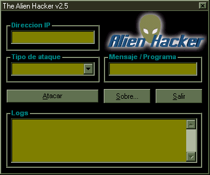



## Client \- Server APP

### Description

ITS AWESOME! This little program comes with a Client and a Server. The PC with the client can control some Windows Functions to the one that has the Server installed on it. A must have!!
 
### More Info
 

             |
---                |---
**Submitted On**   |2000-07-29 17:16:28
**By**             |[Andres Santos](https://github.com/Planet-Source-Code/PSCIndex/blob/master/ByAuthor/andres-santos.md)
**Level**          |Intermediate
**User Rating**    |4.7 (14 globes from 3 users)
**Compatibility**  |VB 6\.0
**Category**       |[VB function enhancement](https://github.com/Planet-Source-Code/PSCIndex/blob/master/ByCategory/vb-function-enhancement__1-25.md)
**World**          |[Visual Basic](https://github.com/Planet-Source-Code/PSCIndex/blob/master/ByWorld/visual-basic.md)
**Archive File**   |[CODE\_UPLOAD84097312000\.zip](https://github.com/Planet-Source-Code/andres-santos-client-server-app__1-10232/archive/master.zip)

